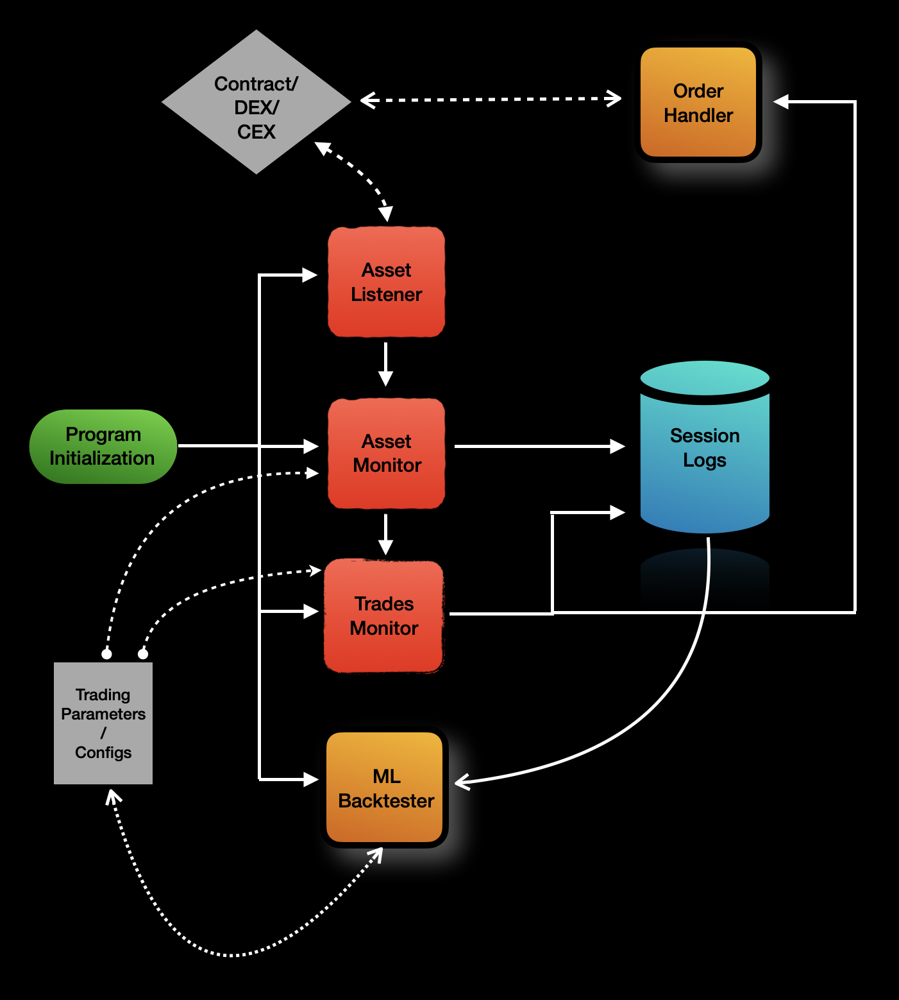

# B46 - Counter Snipe

#### Status: Experimental

## Summary

-------

The genesis of sniping bots exemplifies the market's ability to self-regulate in a dynamic and fast paced environment.
Over the years, the web3 and chain space has garnered a tremendous amount of attention driven by several factors,
some of which simple and others complex. 

This project represents my exploration of human and behavioral transaction patterns through the command line.
I have decided to venture on this experimental journey as a mode of discovery.

This program is my interpretation of a transactions sniper in a crazed market. 

The program is written in go for personal preference. 

## Git Policies

-------

### Branch Structure

- setup/* : All things setup related, like config, env vars, libraries, readme, etc ..
- example/* : Building functions in isolation 
- feature/<module_name>/* : Requirements as features categorized through module function
- fix/<module_name>/* : Fixes in modules
- test/<module_name>/* : Test cases 

## Architecture

-------

## Contents

-------

### Inspiration

-------

<a href="https://github.com/chainstacklabs/pump-fun-bot" target="_blank">Ake Python Trading Bot</a>

### Buy Me A Coffee

-------

* BTC address: bc1qzygvy9cenlg35jkcqh60ff6208nz3c5ldhlr0e
* Solana address: Ek2HgHAKApPmkCzH438zVjzmr4yQrE3MRgxREUepBU4k
* TRON address: TQvoLowWPr6Q2Vs8dVJpzxK5vPYrmUbBuy
